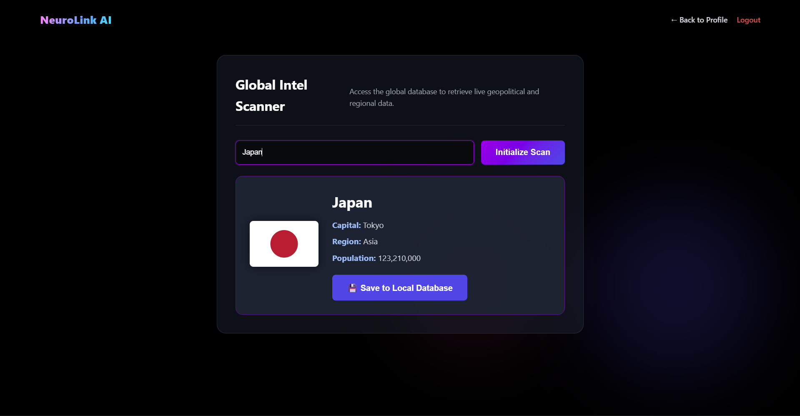

# ACTIVITY 1 January 21,2026

# NeuroLink AI - Futuristic Landing Page

## Description

NeuroLink AI is a conceptual landing page for a next-generation neural interface technology company. This project showcases a futuristic, cyberpunk-inspired design that presents the idea of connecting human consciousness directly to artificial intelligence. The page is designed for tech enthusiasts, early adopters, and anyone interested in the future of human-computer interaction. It solves the problem of presenting complex, cutting-edge technology in an engaging and visually striking way that captures attention and communicates value instantly.

## Technologies Used

- **HTML5** - Semantic markup and structure
- **CSS3** - Advanced styling with animations, gradients, and grid/flexbox layouts
- **Modern Web Standards** - Responsive design, CSS custom properties, and transform animations

## Features

1. **Animated Hero Section** - Eye-catching floating orbs with smooth animations and gradient text effects that create a sense of depth and motion
2. **Interactive Feature Cards** - Hover effects with glow animations and smooth transitions that respond to user interaction
3. **Responsive Grid Layouts** - Fully responsive design using CSS Grid and Flexbox that adapts seamlessly to all screen sizes
4. **Gradient Animations** - Dynamic color-shifting gradients that create a futuristic, tech-forward aesthetic
5. **Cyberpunk Grid Background** - Subtle grid pattern overlay that reinforces the high-tech theme
6. **Smooth Transitions** - All interactive elements feature polished hover states and transform effects

## AI Assistance Disclosure

**Yes, AI was used in this project.**

- **Tool:** Claude (Anthropic)
- **Assistance provided:** Claude helped generate the initial HTML structure, CSS styling concepts, color scheme recommendations, and animation keyframes. It also provided suggestions for the cyberpunk design aesthetic, gradient combinations, and responsive layout patterns.
- **Human contribution:** All code was reviewed, customized, and refined. Design decisions, final color values, spacing adjustments, and the overall creative direction were determined through iterative refinement.

## Learning Reflection

Through this project, I deepened my understanding of CSS animations, particularly keyframe animations and complex gradient effects. The most challenging aspect was balancing visual complexity with performance - ensuring animations were smooth while maintaining clean, readable code. I also learned how to create depth using layered blur effects and opacity, which was crucial for achieving the futuristic aesthetic. This project reinforced the importance of thoughtful hover states and transitions in creating an engaging user experience.

## How to Run

1. Download all files (`index.html`, `style.css`, `README.md`)
2. Ensure they are in the same directory
3. Open `index.html` in any modern web browser
4. No additional dependencies or server required

## Future Enhancements

- Add JavaScript for smooth scroll animations
- Implement parallax scrolling effects
- Add interactive 3D elements using Three.js
- Create animated particle system background
- Add form validation for early access signup

---

**Designed for the future. Built with passion.**

# ACTIVITY 2 January 26, 2026

# NeuroLink AI - Futuristic Landing Page

## Description

NeuroLink AI is a conceptual landing page for a next-generation neural interface technology company. This project showcases a futuristic, cyberpunk-inspired design that presents the idea of connecting human consciousness directly to artificial intelligence. The page is designed for tech enthusiasts, early adopters, and anyone interested in the future of human-computer interaction. It solves the problem of presenting complex, cutting-edge technology in an engaging and visually striking way that captures attention and communicates value instantly.

## Technologies Used

- **HTML5** - Semantic markup and structure
- **CSS3** - Advanced styling with animations, gradients, and grid/flexbox layouts
- **JavaScript (Vanilla)** - Smooth scrolling and scroll-triggered reveal animations
- **Modern Web Standards** - Responsive design, CSS custom properties, and transform animations

## Features

1. **Animated Hero Section** - Eye-catching floating orbs with smooth animations and gradient text effects.
2. **Interactive Feature Cards** - Hover effects with glow animations.
3. **Smooth Scrolling** - JavaScript-powered navigation that smoothly glides to sections when links are clicked.
4. **Scroll Reveal** - Content gently fades in and floats up as you scroll down the page.
5. **Responsive Grid Layouts** - Adapts seamlessly to all screen sizes.

## AI Assistance Disclosure

**Yes, AI was used in this project.**

- **Tool:** Claude (Anthropic) & Gemini (Google)
- **Assistance provided:** - **Claude:** Initial HTML structure, CSS styling concepts, color scheme, and animation keyframes.
  - **Gemini:** Added Authentication UI pages (`login.html`, `signup.html`), implemented the JavaScript for smooth scrolling and scroll reveal animations (`script.js`), and updated the navigation structure.
- **Human contribution:** Code review, customization of design elements, and final integration of all files.

## Learning Reflection

Through this project, I deepened my understanding of CSS animations and how to enhance them with JavaScript. Implementing the smooth scroll manually gave me insight into how single-page navigation works under the hood. I also learned how to use `IntersectionObserver` for efficient scroll-triggered animations instead of relying on heavy scroll event listeners.

## How to Run

1. Download all files (`index.html`, `login.html`, `signup.html`, `style.css`, `script.js`, `README.md`)
2. Ensure they are in the same directory
3. Open `index.html` in any modern web browser
4. No additional dependencies or server required

---

## Pages Added

- **login.html** – A standalone login UI page.
- **signup.html** – A registration UI page.

## New Features

1.  **Multi-page Navigation**: Seamless linking between Landing, Login, and Signup pages.
2.  **Smooth Scroll**: Clicking "Watch Demo" now smoothly scrolls to the Features section.
3.  **Scroll Animations**: Elements fade in as they enter the viewport.

---

**Designed for the future. Built with passion.**

---

# ACTIVITY 3 February 4, 2026

## Activity Name

Add Profile + Settings Pages (UI Navigation Challenge)

## Description

This activity involves extending the existing student project by adding a user dashboard with Profile and Settings pages. It simulates a logged-in user experience where users can view their profile details and access a settings form to update their information. The goal is to implement multi-page navigation and maintain a consistent, futuristic UI theme across a dashboard-style layout without using a backend.

## Technologies Used

- **HTML5** - Semantic structure for the dashboard and forms.
- **CSS3** - Glassmorphism effects, grid layouts for the dashboard, and consistent theming.
- **JavaScript** - Basic navigation handling (optional) and reused scripts.

## Features

1.  **Dashboard Layout** - A two-column grid layout featuring a sidebar for the profile card and a main content area for user details.
2.  **Settings Interface** - A dedicated settings page with a visual-only form for updating email, address, password, and theme preferences.
3.  **Cyclic Navigation** - Full navigation flow connecting Landing → Login → Profile → Settings → Profile → Logout.

## AI Assistance Disclosure

**Yes, AI was used in this project.**

- **Tool:** Gemini (Google)
- **Assistance provided:** Gemini helped generate the HTML structure for the new `profile.html` and `settings.html` pages. It also provided the CSS for the dashboard grid layout and the specific glassmorphism styles for the sidebar to match the existing cyberpunk theme.
- **Human contribution:** I reviewed the code, integrated the new CSS into the existing stylesheet, ensured the links worked correctly across all pages, and verified the project structure.

## Learning Reflection

In this activity, I learned how to create a consistent dashboard layout using CSS Grid and Flexbox. The most challenging part was ensuring the navigation links flowed logically between multiple pages (Login -> Profile -> Settings) and maintaining the visual theme of the landing page within a functional application interface.

---

# ACTIVITY 4 March 4, 2026

## Activity Name

Add Validation Rule

## Description

This activity extends the existing multi-page platform by integrating client-side JavaScript validation. It ensures data integrity on the Login, Signup, and Settings pages by checking email formatting, password length, password matching, and empty fields before allowing the user to proceed with form submission or page navigation.

## Technologies Used

- **JavaScript (Vanilla)** - Used for DOM manipulation, event listening, and Regex email validation.
- **HTML5 & CSS3** - Used for rendering the input fields and dynamically displaying error states (red borders, text messages).

## Features

1. **Real-Time Error Handling:** Highlights invalid input fields with red borders and injects error messages beneath them instantly.
2. **Regex Email Validation:** Ensures users input a properly formatted email address containing an `@` symbol and a domain.
3. **Password Match & Security:** Verifies that passwords meet a minimum character length and that the "Confirm Password" field matches identically.

## AI Assistance Disclosure

**Yes, AI was used in this project.**

- **Tool:** Gemini (Google)
- **Assistance provided:** Gemini helped write the JavaScript logic for validating the forms. It provided a scalable `validateForm` function using Regex for the email, setup the logic to prevent navigation if fields were invalid, and added dynamic error CSS classes.
- **Human contribution:** I reviewed the JavaScript logic, tested the forms across the login, signup, and settings pages, ensuring it integrated flawlessly with my specific HTML class names and ID structures, and pushed it to GitHub Pages to verify full functionality.

## Learning Reflection

Through this activity, I learned how to intercept form submissions and link clicks using event.preventDefault(), gaining practical experience with client-side validation patterns. The most challenging part was architecting a single JavaScript function that could intelligently identify which form it was validating. For example, dynamically distinguishing between authentication flows to ignore empty passwords on the Settings page while strictly requiring them on the Signup page, all without writing completely separate scripts for every HTML file. This required developing a modular validation strategy using form IDs, custom data attributes, and conditional logic to maintain clean, reusable code.

---

# ACTIVITY 5 March 9, 2026

## Activity Name

Create Admin Pages

## Description

This activity introduces admin-side functionality to the platform. It implements role-based routing upon login and provides the system administrator with a dedicated dashboard to oversee platform metrics. Furthermore, it introduces a Data Management interface featuring a fully functional (client-side) CRUD table to add and delete simulated user accounts.

## Technologies Used

- **HTML5 & CSS3** - Used to create a distinct, elevated UI for the admin panels and tables while maintaining the overarching cyberpunk aesthetic.
- **JavaScript (Vanilla)** - Used to implement conditional login routing (Admin vs. Standard User), DOM manipulation for adding new table rows dynamically, and event delegation for handling item deletions.

## Features

1. **Role-Based Login Routing:** Users logging in with `admin@neurolink.ai` are redirected to the Admin Dashboard, while all other valid emails route to the standard Profile view.
2. **Interactive Data Table:** A dynamic "Manage Users" table that allows admins to view static database entries and visually delete them from the DOM.
3. **Dynamic Add Form:** A built-in management form that validates inputs and instantly appends new user data (with randomly generated IDs) directly into the live table.

## AI Assistance Disclosure

**Yes, AI was used in this project.**

- **Tool:** Gemini (Google)
- **Assistance provided:** Gemini provided the HTML structure for the new `admin.html` and `manage-users.html` pages. It also helped refactor my `script.js` to conditionally route the login button based on the email input value, and wrote the JavaScript DOM manipulation code required to make the "Add User" form and "Delete" buttons functional on the client side.
- **Human contribution:** I integrated the changes into my local project environment, reviewed the logic to ensure my original validation rules from Activity 4 were preserved, and tested the admin vs user login flow on my live GitHub pages deployment.

## Learning Reflection

This activity gave me an excellent introduction to how real web applications separate standard user privileges from administrative ones. I learned how to use JavaScript to intercept form values and conditionally redirect users (`window.location.href`). I also gained practical experience with DOM manipulation by dynamically creating HTML table rows (`document.createElement`) and handling delete actions using event delegation.

---

# ACTIVITY 6 March 16, 2026

## Project Title

Global Intel Scanner (NeuroLink API Integration)

## Description

This application extends the NeuroLink AI platform by allowing users to query a live, external database for geopolitical information. It simulates a futuristic global scanner where users can input the name of a country/region and instantly receive formatted demographic and geographic data.

## API Used

**REST Countries API** (`https://restcountries.com/v3.1/name/`)
Provides public, free, and secure demographic data (such as capitals, regions, population, and flag images) for countries worldwide.

## Features

- **Live Data Retrieval:** Fetches real-time JSON data from an external API.
- **Dynamic DOM Rendering:** Constructs and displays a styled "Intel Card" containing the country's flag, capital, population, and region without reloading the page.
- **Robust Error Handling:** Detects empty inputs, handles 404 "Not Found" API errors (if a user types a fake country), and catches network connection drops, displaying user-friendly error messages on the UI.
- **Loading States:** Disables the search button and indicates "Scanning Network..." while the asynchronous fetch request is processing.

## How to Use

1. Log in to the application and navigate to the User Profile.
2. Click the "Launch Scanner" button under the Global Intel feature card to open the API interface.
3. In the input field, type the name of a country (e.g., "Japan", "Brazil", "France").
4. Click "Initialize Scan" (or press Enter) to view the API results.

## Challenges Encountered

The main challenge was handling the asynchronous nature of JavaScript (`Promises`). I had to ensure that the UI properly waited for the `fetch()` call to resolve before attempting to read the JSON data. Additionally, gracefully handling errors—such as when a user types gibberish that doesn't exist in the API database—required explicitly checking `!response.ok` to manually throw an error and display it in the custom error box, rather than letting the console crash silently.

## Screenshot

---
